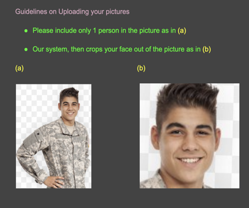

# Artificial-Barber

Hair Style and Color changing using improved version of StyleGAN2, deployed on interactive Graphical User Interface (GUI) with PyQt.


## Setup

Clone repo and install [requirements.txt](https://github.com/abbasmammadov/Artificial-Barber/blob/main/requirements.txt) in a
[**Python>=3.7.0**](https://www.python.org/) environment.

```bash
git clone https://github.com/abbasmammadov/Artificial-Barber  # clone
cd Artificial-Barber
pip install -r requirements.txt  # install all the required dependencies
```

## Inference

To try our model with your own choice of images we provided 2 options 

### Using our Graphic User Interface </Summary>
We recommend using this option for inference, especially for those who are unfamiliar with linux and bash commands. 

As shown below, our GUI is easy to use and provides users variety of options interms of choosing target color and style, as well as inference speed.
original image here
* Run ``python main.py`` and upload your input image (from any directory). Please check whether your image fulfills the requirements shown below


* Then our GUI automatically runs the ``face.py`` code, and performs face-alignment. 
* Check whether to use the "fast-inference" or the "Best Quality" option. Fast Inference runs lighter models to achieve results as fast as possible, compromising quality, whereas "Best Quality" ensures to yield best results, but takes relatively longer time to process.
* If you see a success image, move to selecting the color and style of your choice
  ##### Options Provided To choose your target color
  - You can choose either simple colors from the options in the "basic" category, or combination of colors from our "combo" option
  - #### As an another option, we provided a color palette where you can select your desired customized color.
  **Note**: Please make sure to check the "Use custom color" option to use this option.
  - Moreover using the "Custom color image" you can upload an image of your choice and our model converts to the hair color of that image
  
  ##### Options Provided to choose your target style
  - First, when you hover your mouse over the given styles, you will see an example image carrying that style
  - You can choose either simple styles or you can also upload an image of your choice, and our model converts to the hair style of that image
  
  Then all you need to do is, pressing the "Generate" button and see the magic!!
  
  After the result is done, you will see an output which looks like this.
  result image here
 
 
### Using Terminal </Summary>
- If you prefer using the terminal, please follow the steps given below

* Please make sure that the input image is placed in the same directory with ``face.py``. Then execute 
```bash 
  python face.py
```
 
 Then the aligned face will be stored in the directory ``img/input/``. After that, all you need to do is executing the command below
```bash 
  python inference.py --im_path1 {path_of_your_input_image} --im_path2 {path_of_the_image_with_your_target_style} --im_path3 {path_of_the_image_with_your_target_color} --output_dir {desired_path_to_store_output_images_and_their_masks}
```
**Note**: the model takes the path of the images with your target color ***relative to the*** ``img/appearance/`` ***directory*** and the path of the image with your target style ***relative to the*** ``img/structure/`` ***directory***. Hence, if you want to use your own image as a target color or style, please make sure to put your images with your taret color and target style in the directories ``img/appearance/`` and ``img/structure/`` respectively. 

Then the result output and its mask will be saved to your output path folder. 
 
